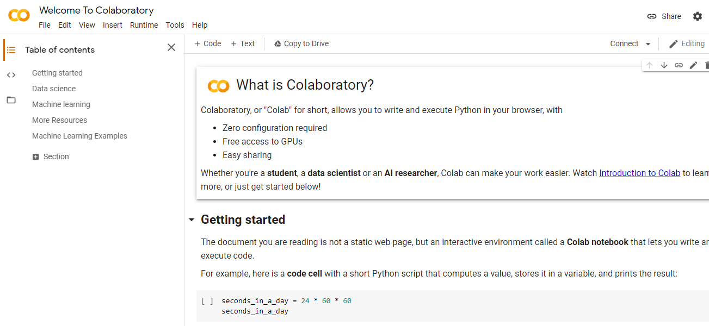
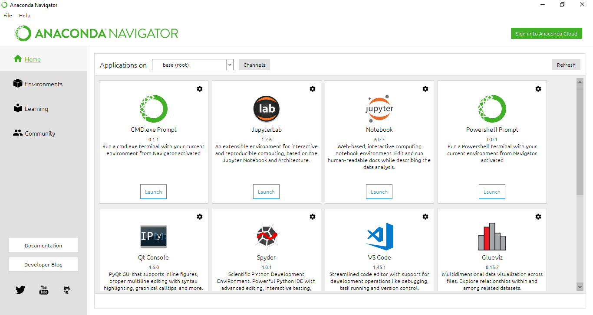
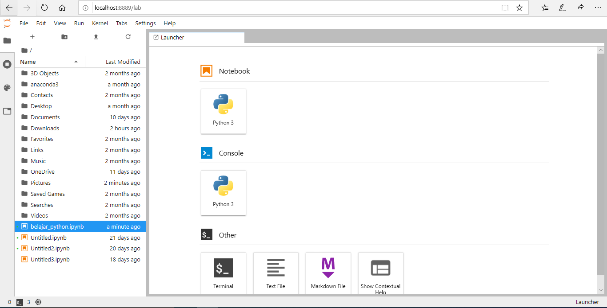
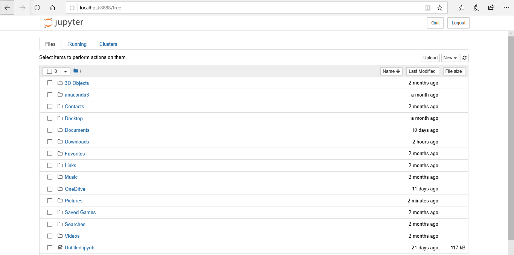

# basic_python

> Belajar menggunakan python dengan beberapa case yang diberikan

## Aplikasi yang digunakan untuk python :
1. bisa menggunakan [googlecolab](https://colab.research.google.com/notebooks/intro.ipynb) dan tidak perlu download. 

Tampilan google colab seperti ini 



2. Silahkan download [Anaconda](https://anaconda.com/download). Install sesuai dengan sistem operasi masing - masing. Setelah itu clone / download repositori ini ke folder kalian inginkan.

## Menggunakan Anaconda Navigator

- MacOS dan Linux:
   - Buka terminal, kemudian ketik

```sh
$ anaconda-navigator
```

- Windows:
    - Buka launcher windows, kemudian pilih program Anaconda Navigator

Tampilan Anaconda Navigator akan seperti ini.



Silahkan launch jupyter lab / jupyter notebook kemudian navigasi ke folder yang telah kalian simpan.

## Menggunakan Terminal atau Anaconda Prompt

- MacOS dan Linux:
   - Buka terminal, kemudian ketik

```sh
$ jupyter-lab
```

atau

```sh
$ jupyter notebook
```

- Windows:
   - Buka Anaconda Prompt, kemudian ketik

```sh
C:\> jupyter-lab    
```

atau

```sh
C:\> jupyter notebook   
```

Kemudian navigasi ke folder yang telah kalian simpan.

## Tampilan Jupyter-lab



## Tampilan Jupyter Notebook


## Inspirasi

Materi repositori ini saya dapatkan ketika saya sedang mengikuti bootcamp [Altera Academy](https://academy.alphatech.id/program_se.html)
